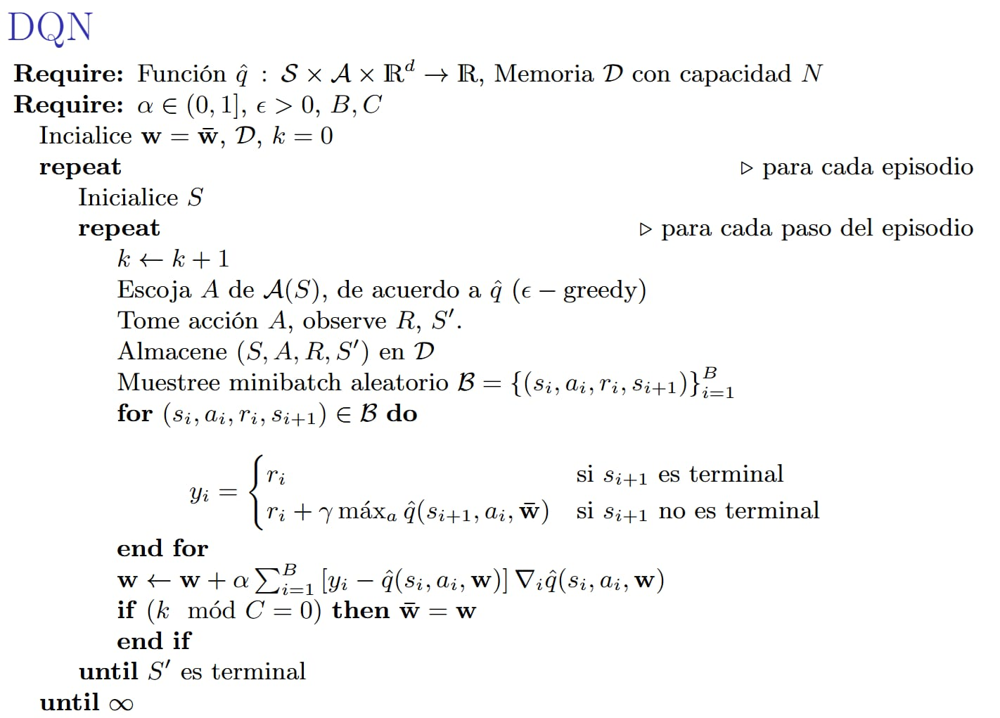

# Informe final

Este informe muestra el resultado de aplicar tecnicas de deep reinforcement learning a dos problemas problemas clasicos:

1. Lunar landing
2. Beam rider

Ambos problemas tienen niveles de dificultad diferentes, lunar landing tiene un scope mucho mas pequeño (como veremos probado mas adelante) ya que de cierta forma
el agente tiene el control sobre la totalidad de lo que ocurre en el sistema, mientras que en beam rider tienes otros agentes (hasta 4 adicionales) y
elementos moviles que hacen que el espacio de busqueda y optimizacion sea mucho mas grande.

# Marco teorico 

## Reinforcement learning

Basado en Sutton & Barto, se podria definir el reinforcement learning el  como el proceso de aprendizaje maquina que se desarrolla por medio de la interaccion
con el ambiente, deduciendo de dichas interacciones un mapeo de situaciones a acciones tal que se maximice una señal de recompensa.

Este proceso de aprendizaje maquina se ve reflejado en un artefacto digital que puede ser una tabla acciones valores, una red neuronal, o cualquier
artefacto que permita almacenar información de forma efectiva para el mapa situaciones-acciones, y es la construccion de dicho artefacto 
lo que compete al area de investigación de aprendizaje por refuerzo.

##  Aprendizaje por refuerzo profundo: DQN

### Precedentes 

Antes de el advenimiento de el aprendizje profundo, las implementaciones de aprendizaje por refuerzo usaban tablas comunes (las tablas que puedes encontrar en cada lenguaje de programación) }
para almacenar alli los resultados de el entrenamiento (esto para los metodos tabulares).

El problema con este enfoque es que si el espacio de estados es demaciado grande, dicha tabla crecia fuera de las capacidades de computo actuales, 
por otro lado si el espacio de acciones era muy grande (o continuos en un rango x, y) dicho problema era intratable con las tecnicas comunes hasta ese momento.

Con el advenimiento de las redes neuronales, estas fueron introducidas tanto de forma teorica como practica a los metodos de aprendizaje por refuerzo,
optimizando sobre todo la representación de la tabla de estados-acciones de la siguiente forma:

1. Las q tablas comenzaron a ser representadas por redes W cuyas entradas eran los estados observados S y las salidas A, el valor esperado de la funcion de retorno aproximada (esto puede ser diferente en implementaciones avanzadas como QR-DQN)
- Lo anterior permitio que estados similares sean mapeados a su representación más parecida por la naturaleza del espacio vectorial, incrementando la eficiencia en estados no visitados siempre que estos se parezcan a los estados de entrenamiento
- Adicionalmente, las redes neuronales funcionan como una representación vectorial más óptima que una tabla completa con todos los estados visitados, reduciendo en varios ordenes de magnitud el tamaño de la q tabla.
2. Con una representación más óptima, los problemas de aprendizaje por refuerzo expandieron su uso a espacios de estado mucho mas grandes que ahora son posibles de computar.
3. El espacio de acciones abordable de forma práctica también se amplió, las redes neuronales pueden representar espacios de acciones o muy grandes o directamente continuos en un intervalo x, y.
4. Previamente, un mecanismo de entrenamiento no podia ser reusado en un problema particular, dado que cada q tabla debia ser diseñada a medida, con heuristicas para optimizar la representacion de estado de manera mas eficiente. El advenimiento de el
aprendizaje por refuerzo profundo removio esta necesidad, haciendo que ahora un mismo mecanismo de entrenamiento sea mucho mas facil de reusar entre problemas.

# DQN 

Tomandonos la licencia de saltar directamente al aprendizaje por refuerzo profundo, nos encontramos  con 
un algoritmo llamado DQN, el cual se muestra a continuacion:

##  Puntos a notar del algoritmo DQN

### Replay de experiencias
Este en vez de usar simplemente las observaciones en su entrenamiento y desecharlas, las almacena en una memoria `D` la cual 
permite luego replicar estas experiencias en mini batches, los cuales se usan para mejorar el cálculo interno de la red de la funcion de retorno.

## Target network

En vez de calcular la acción durante el entrenamiento con la red que se está entrenando (a la que se le están actualizando durante el entrenamiento), 
se usa una red la cual se deja inalterada cada ciertos N episodios, y es con esta que se toma la acción en cada paso. 

Lo anterior se hace para estabilizar el entrenamiento, si la misma red que recibe actualizaciones es la que se usa para actuar en cada episodio, 
significa que la red cambiara cada paso, haciendo que dicha red no alcance a aprender bien sus observaciones.

# Problema 1: lunar landing

El **Lunar Lander** es un juego clásico donde el objetivo es aterrizar una nave espacial en una plataforma de aterrizaje.
La nave debe:

- Controlar su velocidad y posición
- Evitar chocar contra el suelo
- Minimizar el uso de combustible
- Aterrizar suavemente en la zona designada

---

## Especificaciones Técnicas

### Espacio de Acciones

- **Tipo:** Discreto (4 acciones)
  - `0`: No hacer nada
  - `1`: Disparar motor principal (empuje hacia arriba)
  - `2`: Disparar motor izquierdo (empuje hacia la derecha)
  - `3`: Disparar motor derecho (empuje hacia la izquierda)

---

### Espacio de Observaciones

- **Dimensión:** 8 variables continuas

1. Posición **X**: Coordenada horizontal `(-2.5 a 2.5)`
2. Posición **Y**: Coordenada vertical `(-2.5 a 2.5)`
3. Velocidad **X**: Velocidad horizontal `(-10 a 10)`
4. Velocidad **Y**: Velocidad vertical `(-10 a 10)`
5. **Ángulo**: Orientación de la nave `(-π a π)`
6. Velocidad **Angular**: Velocidad de rotación `(-10 a 10)`
7. **Pata Izquierda**: Contacto con el suelo `(0 o 1)`
8. **Pata Derecha**: Contacto con el suelo `(0 o 1)`

### Sistema de Recompensas

- **Aterrizaje exitoso:** +100 a +140 puntos (dependiendo de la suavidad)
- **Crash:** -100 puntos
- **Uso de motores:** Penalización por combustible usado
- **Distancia a la plataforma:** Recompensa por proximidad
- **Velocidad:** Penalización por alta velocidad

### Estados Finales

- **Éxito:** Aterrizaje suave en la plataforma
- **Crash:** Colisión con el terreno
- **Timeout:** Superar el límite de pasos (típicamente 1000)

# ¿Por qué DQN?

Se escogió **Deep Q-Network (DQN)** como método principal para este proyecto debido a su capacidad de manejar espacios de estado continuos con un espacio de acciones discreto, ofreciendo un balance entre eficiencia y estabilidad en el entrenamiento.

---

## Ventajas de DQN para este Problema

- **Espacio de Estados Continuo:**
  El espacio de observación tiene 8 dimensiones continuas. DQN puede manejar esto usando redes neuronales como aproximadores de función.

- **Espacio de Acciones Discreto:**
  Con solo 4 acciones posibles, DQN es ideal ya que puede estimar el valor Q para cada acción directamente.

- **Estabilidad de Entrenamiento:**
  Las técnicas de DQN (*target network, experience replay*) proporcionan la estabilidad necesaria para este problema complejo.

- **Eficiencia de Muestreo:**
  *Experience replay* permite reutilizar experiencias pasadas, mejorando la eficiencia del aprendizaje.

## Arquitectura del Sistema

### Componentes Principales

1. **Environment**: Wrapper del entorno Gymnasium
2. **DQNNetwork**: Red neuronal para aproximar función Q
3. **DQNAgent**: Agente que toma decisiones
4. **DQNUpdater**: Maneja el entrenamiento y actualización de pesos
5. **ReplayBuffer**: Almacena experiencias para replay
6. **Logger**: Sistema de logging y monitoreo

## Red Neuronal DQN

### Arquitectura Elegida

La red neuronal utilizada para aproximar la **función Q** en este proyecto sigue la arquitectura:

- **Capas:** `8 → 256 → 256 → 4`
- **Función de Activación:** ReLU
- **Inicialización de Pesos:** Xavier Uniform

En detalle:

1. **Capa de Entrada (8 neuronas):**
   Corresponde a las 8 variables continuas que describen el estado del entorno Lunar Lander (posición, velocidad, ángulo y contacto de las patas).

2. **Capas Ocultas (256 neuronas cada una):**
   Dos capas densas que permiten capturar representaciones no lineales y patrones complejos en los estados observados.

3. **Capa de Salida (4 neuronas):**
   Representa el valor Q estimado para cada una de las **4 acciones discretas** disponibles en el entorno (`no hacer nada`, `motor principal`, `motor izquierdo`, `motor derecho`).

---

### Razones para esta Elección

- **256 neuronas en cada capa oculta:**
  Proporcionan suficiente capacidad para modelar relaciones complejas sin caer en **overfitting** ni hacer que el entrenamiento sea demasiado lento.

- **Dos capas ocultas:**
  Ofrecen un buen balance entre **poder expresivo** y **eficiencia de entrenamiento**. Modelos más profundos podrían ser innecesarios para este problema.

- **ReLU como función de activación:**
  - Evita el problema de gradientes desvanecientes.
  - Introduce no linealidad manteniendo la computación eficiente.
  - Funciona bien en redes profundas aplicadas a entornos de control continuo/discreto.

- **Inicialización Xavier Uniform:**
  Garantiza que la varianza de las activaciones se mantenga estable a lo largo de la red, evitando explosión o desaparición de gradientes en las primeras fases del entrenamiento.

## Proceso de Entrenamiento

El entrenamiento del agente se basa en el algoritmo **Deep Q-Network (DQN)**, que combina el aprendizaje Q clásico con redes neuronales, *experience replay* y *target networks* para lograr un aprendizaje estable.

---

### Algoritmo DQN Paso a Paso

#### Inicialización
- Crear **Q-Network** y **Target Network** (inicialmente con los mismos pesos).
- Inicializar un **Replay Buffer** vacío para almacenar experiencias pasadas.
- Establecer **ε = 1.0**, representando la máxima exploración al inicio.

#### Para cada episodio
1. **Resetear entorno** → obtener el estado inicial.
2. **Para cada paso del episodio:**
   - Seleccionar acción con estrategia **ε-greedy** (aleatoria con probabilidad ε, o la mejor acción según la Q-Network con probabilidad 1-ε).
   - Ejecutar acción en el entorno → obtener `nuevo estado`, `recompensa` y `done`.
   - Almacenar la transición `(estado, acción, recompensa, nuevo estado, done)` en el **Replay Buffer**.
   - Actualizar la **Q-Network** (si el buffer contiene suficientes experiencias).
   - Actualizar la **Target Network** cada *N* pasos para estabilizar los objetivos de aprendizaje.
3. **Decrementar ε** gradualmente para reducir la exploración y aumentar la explotación.

---

### ¿Por qué este proceso funciona?

El uso de experience replay mejora la estabilidad del entrenamiento porque rompe las correlaciones entre muestras consecutivas; en lugar de aprender solo de secuencias dependientes, el agente entrena con experiencias pasadas tomadas aleatoriamente, lo que favorece un aprendizaje más general y eficiente.

Por su parte, la incorporación de una target network evita que los valores Q se actualicen de manera inestable, ya que mantiene una red separada que solo se sincroniza cada cierto número de pasos, estabilizando así los objetivos de aprendizaje y facilitando la convergencia.

Finalmente, el mecanismo de epsilon decay permite que el agente explore ampliamente al inicio del entrenamiento y, de forma gradual, vaya reduciendo esta exploración para enfocarse en la explotación de las mejores acciones aprendidas. Esto genera una transición natural desde la fase de descubrimiento hasta la ejecución de una política casi determinística.

# Análisis de Resultados

Para este analisis de resultados se han elegido las siguientes metricas:

1. Recompensa por episodio (grafica simple y grafica con medias moviles)
2. Pasos por episodio
3. Epsilon (tasa de exploración)
4. Perdida de diferencia temporal (TD Loss)

# Que nos dice cada métrica?

## Recompensa por epdisodio
La recompensa por episodio habla sobre que tanto ha aprendido el agente a lo largo del tiempo, si la recompensa es alta significa que el agente ha aprendido a aterrizar de manera eficiente.

Si la grafica tiende a crecer con una pendiente pronunciada significa que el modelo esta aprendiendo bien.

Si la grafica se estabiliza en un valor alto significa que el modelo esta cerca de converger (almenos a un minimo local)

## Pasos por episodio

Si bien es el reward el que tiene la ultima palabra, los pasos por episodio nos pueden dar una idea de que tan eficiente es el agente. Si el agente aprende a aterrizar en menos pasos, es probable que este aprendiendo una buena politica, si tiene una explosion de pocos
o muchos pasos (por experimentos tenemos que al rededor de 200 esta el valor correcto) es probable que el agente este aprendiendo una mala politica.

## Epsilon

Examinar como evoluciona epsilon nos da una visual de si el decaimiento esta bien configurado o no

## Perdida de diferencia temporal (TD Loss)

La perdida de diferencia temporal nos da una idea de que tan bien el modelo esta aprendiendo, si la perdida es alta significa que el modelo no esta aprendiendo bien, si la perdida es baja significa que el modelo esta aprendiendo bien.

Adicional, con relacion a la evolucion de la perdida temporal, se esperan valores estables, decrecientes, no saltos abruptos lo cual podria indicar que el modelo diverge

